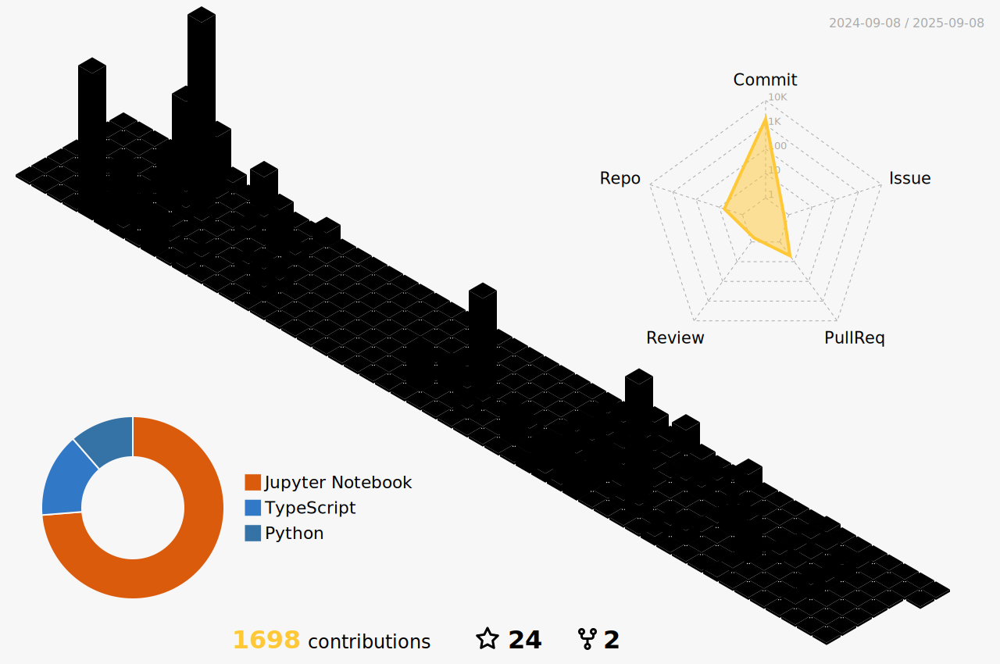

  

  
  
  
  
  
  
  
  
  
  
  

<h1>
   
</h1>

<!-- Заголовок "About Me" с эффектом blur -->

<!-- 3D Contribution Graph справа -->

<!-- Текст "About Me" -->
<ul>
  <li>
    Passionate developer from Russia with a strong background in Software Engineering.
  </li>
  <li>
    Experienced in building diverse projects — from experimental ideas to full-fledged applications.
  </li>
  <li>
    Thrive on tackling complex challenges and enjoy solving problems through code.
  </li>
  <li>
    Constantly inspired to turn innovative concepts into tangible, working solutions.
  </li>
  <li>
    Lifelong learner who’s always exploring new technologies and development trends.
  </li>
  <li>
    Believe in clean, maintainable code and collaborative work that brings real value.
  </li>
</ul>

<h1>
   
</h1>

   
  

<!-- Trophies & Views -->

  
  

<!-- Stats, WakaTime, Summary Cards -->

  <table style="width: 80%; border-collapse: collapse;">
    <tr>
      <td style="text-align: center; vertical-align: top; padding: 20px;">
            
         
      </td>
      <td style="text-align: center; vertical-align: top; padding: 20px;" rowspan="2">
          
          
          
      </td>
    </tr>
  </table>

  

