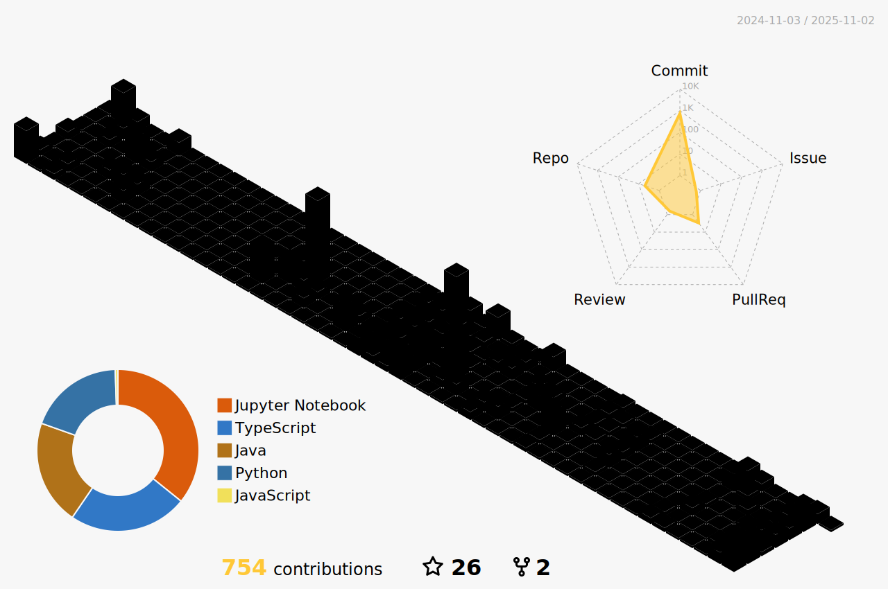

  

  
  
  
  
  
  
  
  
  
  
  

  

  

  
  

  <table style="width: 80%; margin-top: 20px; border-collapse: collapse;">
    <tr>
      <td style="text-align: center; vertical-align: top; padding: 20px;">
          
          
      </td>
      <td style="text-align: center; vertical-align: top; padding: 20px;" rowspan="2">
          
          
               
      </td>
    </tr>
  </table>

  

  

