  

  <h1>
    
    Hi, welcome!</h1>

  
  

<h2>
  
  I'm Andrey Zakharov
</h2>

<h3>
  
  About Me
</h3>

<ul>
  <li>I am an enthusiastic developer from Russia with experience in Software Engineering, skilled in working on a variety of projects. I enjoy challenges and can code anything that sparks my interest, transforming ideas into reality.
  </li>
</ul>

<h3>
  
  Let's Connect
</h3>

<ul>    

  
  
  
  
  
  
  
  
  

</ul>

<h2>
  
  Explore My Stats
</h2>

  <table style="width: 80%; margin-top: 20px; border-collapse: collapse;">
    <tr>
      <td style="text-align: center; vertical-align: top; padding: 20px;">
        <h3>GitHub</h3>
        
        <h3>Languages</h3>
          
        
      </td>
      <td style="text-align: center; vertical-align: top; padding: 20px;" rowspan="2">
        <h3>Achievements</h3>
          
        
        <h3>WakaTime</h3>
        
        <h3>LeetCode</h3>
        
      </td>
    </tr>
  </table>

  

  
<strong>Resources</strong>
  

  

    Below is a collection of resources that contributed to the development of this README. Some were directly used, while others served as sources of inspiration, guiding its structure and enhancing clarity.
  

  <ul>
    <li><a href="https://github.com/abhisheknaiidu/awesome-github-profile-readme">Awesome GitHub Profile Readme</a></li>
    <li><a href="https://github.com/rzashakeri/beautify-github-profile">Beautify GitHub Profile</a></li>
    <li><a href="https://github.com/lowlighter/metrics">Lowlighter Metrics</a></li>
    <li><a href="https://github.com/Ileriayo/markdown-badges">Markdown Badges</a></li>
    <li><a href="https://github.com/anuraghazra/github-readme-stats">Anurag's GitHub Stats</a></li>
    <li><a href="https://github.com/DenverCoder1/github-readme-streak-stats">GitHub Streak Stats</a></li>
    <li><a href="https://github.com/ryo-ma/github-profile-trophy">GitHub Profile Trophy</a></li>
    <li><a href="https://github.com/Nathan13888/VisitorBadgeReloaded?tab=readme-ov-file#migrating-from-visitor-badge">Visitor Badge Reloaded</a></li>
    <li><a href="https://github.com/pujux/badge-it?tab=readme-ov-file">Badge It</a></li>
    <li><a href="https://github.com/journey-ad/Moe-Counter">Moe Counter</a></li>
    <li><a href="https://github.com/yoshi389111/github-profile-3d-contrib">GitHub Profile 3D Contrib</a></li>
    <li><a href="https://github.com/alexandresanlim/Badges4-README.md-Profile">Badges4 README.md Profile</a></li>
    <li><a href="https://github.com/CLorant/readme-social-icons">Readme Social Icons</a></li>
  </ul>

